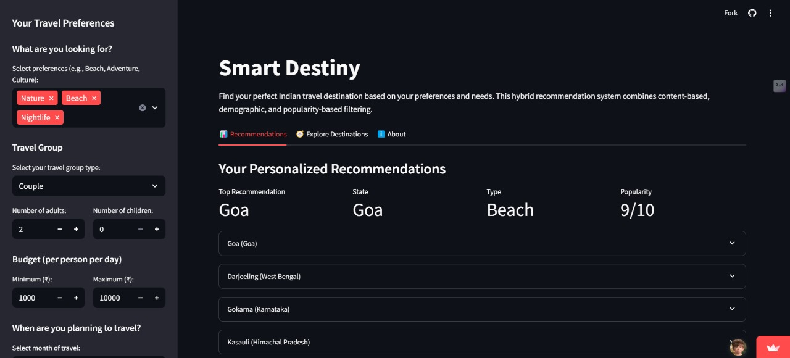

# Smart Destiny - Indian Travel Recommendation System


## 📌 Overview

**Smart Destiny** is a comprehensive travel recommendation system designed to help users discover their ideal Indian travel destinations based on personalized preferences, group composition, budget constraints, and seasonal considerations. The project leverages a hybrid recommendation approach that combines multiple filtering strategies to deliver highly tailored travel suggestions.

## ✨ Features

- **Preference-Based Matching**: Find destinations matching your interests (Beach, Adventure, Culture, etc.)
- **Demographic Filtering**: Recommendations optimized for your travel group (Families, Solo travelers, Couples, etc.)
- **Budget-Aware Suggestions**: Destinations filtered to match your spending capacity
- **Seasonal Optimization**: Recommendations consider ideal travel times for each destination
- **Popularity Ranking**: Factor in destination popularity in recommendation scoring
- **Comprehensive Destination Database**: Rich information on 30+ popular Indian destinations
- **Interactive UI**: User-friendly interface built with Streamlit
- **Detailed Explanations**: Understand why each destination was recommended

## 🖥️ Tech Stack

- **Python**: Core programming language
- **Pandas & NumPy**: Data management and analysis
- **Streamlit**: Interactive web interface
- **Scikit-learn**: Feature scaling and similarity calculations

## 🚀 Getting Started

### Prerequisites

- Python 3.8+
- pip package manager

### Installation

1. Clone the repository:
   ```bash
   git clone https://github.com/Omiiii47/Travelling_RS.git
   cd Travelling_RS
   ```

2. Install dependencies:
   ```bash
   pip install -r requirements.txt
   ```

3. Run the Streamlit app:
   ```bash
   streamlit run app.py
   ```

4. Run the demonstration script (optional):
   ```bash
   python Demonstration.py
   ```

## 🧠 How It Works

The recommendation system utilizes a hybrid approach by combining:

1. **Content-Based Filtering**: Matches destination attributes with user preferences
2. **Demographic Filtering**: Adjusts scores based on the travel group composition
3. **Budget Filtering**: Eliminates destinations outside the user's budget range
4. **Seasonal Filtering**: Promotes destinations that are ideal for the selected travel month
5. **Hybrid Scoring**: Combines all factors with appropriate weights for final recommendations

### Special Features

- **Family Optimization**: Destinations with higher family-friendly scores are boosted for groups with children
- **Match Percentage**: Visual indicator of how well each destination matches user preferences
- **Exploration Mode**: Browse all destinations with filtering and sorting options
- **Detailed Insights**: Access comprehensive information about each destination

## 📊 Dataset

The system uses a curated dataset (`expanded_indian_destinations.csv`) containing:

- Destination names and states
- Type classifications (Beach, Hill Station, Heritage, etc.)
- Experience offerings and activities
- Budget ranges (min-max per day)
- Best seasons to visit
- Demographic suitability scores (family, solo, couple, senior-friendly)
- Popularity ratings

## 📁 Project Structure

- `app.py` - Streamlit web application
- `recommendation_system.py` - Core recommendation engine
- `Demonstration.py` - Command-line demonstration
- `expanded_indian_destinations.csv` - Dataset of Indian destinations

## 📷 Screenshots

### Homepage & Preference Selection


### Personalized Recommendations


### Top Recommendation with Match Score


### Explore All Destinations


### Destination Details


## 🚧 Future Enhancements

- [ ] User accounts and saved preferences
- [ ] Integration with accommodation booking APIs
- [ ] More destinations and detailed information
- [ ] Itinerary generation
- [ ] User reviews and ratings

---
